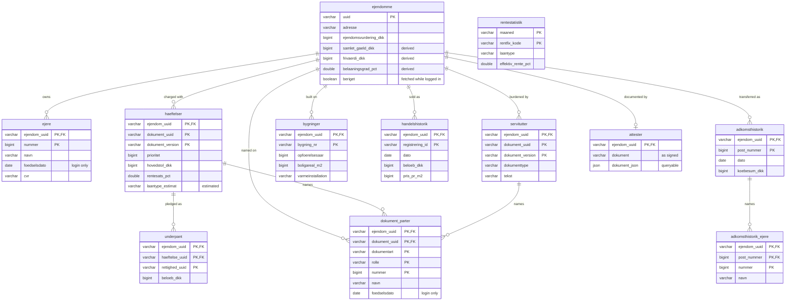

<p align="center">
  
</p>

<h1 align="center">yaybo</h1>

<p align="center">
  Look up a Danish address, see what the land register (Tingbogen) holds on it,
  and keep the results in a local DuckDB database you can browse, query and
  export from your terminal.
  <br>
  <a href="https://pypi.org/project/yaybo/"></a>
</p>

<p align="center">

<a href="https://github.com/j178/prek"></a>
<a href="https://github.com/astral-sh/uv"></a>
<a href="https://github.com/astral-sh/ruff"></a>
<a href="https://github.com/astral-sh/ty"></a>
<a href="https://github.com/tox-dev/tox-uv"></a>
<a href="https://github.com/kiliantscherny/yaybo/actions/workflows/ci.yml"></a>
<a href="https://github.com/kiliantscherny/yaybo/actions/workflows/release.yml"></a>
</p>

---

> [!CAUTION]
> **This is a hobby project. It is not built for production use, and nothing
> about it is supported.**
>
> It is not affiliated with, endorsed by, or connected to tinglysning.dk,
> Domstolsstyrelsen, MitID, NemLog-in, Boligsiden, Danmarks Statistik or
> Dataforsyningen. Those names appear here only to say where the data comes
> from.
>
> Provided as-is, with no warranty of any kind. **Use it at your own risk.** The
> author accepts no liability for any loss, damage, or misuse arising from it,
> and none of it is financial, legal or property advice.

## Install

```sh
uv tool install yaybo    # or: pip install yaybo
```

Python 3.10 or newer. `uvx yaybo` runs it without installing anything.

## Quickstart

```sh
yaybo                                       # open the TUI
yaybo fetch "Prøvegade 1, 9999 Prøveby"     # fetch one address
yaybo --version                             # which version is installed
```

Results go to `out/tinglysning.duckdb`. Looking the same address up again
replaces its rows rather than adding a second copy.

## Where the data comes from

| source | what it provides | login needed |
| --- | --- | --- |
| **tinglysning.dk** | owners, mortgages and charges, easements, past transfers | partly |
| **Boligsiden** | sale prices, price per m², and the BBR record (year built, rooms, walls, heating) | no |
| **Danmarks Statistik** | what each kind of realkredit loan cost month by month, used to read a bare interest rate as an F3 or a fixed loan | no |
| **DAWA** | address lookup and validation while you type | no |

Most of it is available without logging in. Logging in with MitID adds owners'
dates of birth, everyone named on each mortgage, and the history of previous
owners.

> [!NOTE]
> This tells you who **owns** a property, not who lives there. Resident data
> (CPR/folkeregisteret) is not public in Denmark, with or without a login. If a
> property is rented out you get nothing about the tenant. The owner is
> sometimes a company with a CVR number rather than a person.

## The TUI

> [!WARNING]
> The TUI is a work in progress and will change.

Run `yaybo` with no arguments. Six screens, all reading the same database:

| screen | key | what it is for |
| --- | --- | --- |
| **Library** | `l` | everything you have fetched, searchable offline |
| **Search** | `/` | find an address, see what the register holds at it |
| **Queue** | `b` | fetch many properties in the background |
| **Nøgletal** | `k` | figures across a set of properties |
| **SQL** | `s` | query the database directly |
| **Property** | `enter` | one property in full |

**Library** is where it opens. Each row shows how stale it is, its valuation,
debt and loan-to-value, and whether it was fetched while logged in. Sort by any
column with `o`, filter with `name:value`, tick rows with `space` and act on the
lot. `enter` opens a property, `f` re-fetches, `e` exports.

**Search** resolves your typing against [DAWA](https://dawadocs.dataforsyningen.dk/),
then asks the register which properties actually sit at that address – one for a
rented block, over a hundred for a block of owner-occupied flats. Tick the ones
you want and press `f` to hand them to the queue.

**Property** shows one property, tab by tab, read back out of the database, so
it is instant and works offline:

- **Oversigt** – what it is, who owns it, what it is worth, what it owes
- **Ejere · Hæftelser · Servitutter · Parter · Handler** – the tables in full,
  with each charge's interest terms and the loan product it implies
- **Forløb** – sales, transfers, mortgages, easements and valuations on one
  timeline. The register keeps these as four separate lists
- **Kurve** – price per square metre over time
- **Bygning** – the BBR record
- **Dokument** – the signed attest itself

**Queue** takes what Search hands it and fetches in the background, with a
progress bar and per-row status. Pause with `space`. Anything already fetched is
already saved, so a lapsed login partway through costs you nothing.

**Nøgletal** answers questions about a set of properties rather than one:
median price per m² by floor, valuations by building, owners by postcode.
Narrow the set with dropdowns filled from the database, then pick a figure.
Nothing is fetched – it describes only the properties you already hold.

**SQL** runs read-only queries against the whole database, with eight examples
ready to load and edit. `ctrl+R` runs, `ctrl+E` exports the result.

Press `ctrl+L` anywhere to log in with MitID, or to log out.

## On the command line

```sh
yaybo                              # the TUI
yaybo --version                    # the installed version
yaybo fetch ADDRESS [ADDRESS ...]  # look addresses up and store them
yaybo export                       # write what is stored to a spreadsheet
yaybo login --user YourMitIDUserID
yaybo status                       # is the session good, and for how long
yaybo keepalive [MINUTES]          # hold it open without another trip to the phone
yaybo backfill                     # re-derive stored tables, fetching nothing
yaybo logout
```

`fetch` takes several addresses at once and pauses between them. One that
cannot be resolved is reported and skipped; the rest still get fetched.

```sh
yaybo fetch "Prøvegade 1, 9999 Prøveby" "Prøvevej 2, 9999 Prøveby"
```

Useful `fetch` options:

| option | what it does |
| --- | --- |
| `--format LIST` | `duckdb` (default), `csv`, `xlsx`, or a comma-separated list |
| `--limit N` | most properties to fetch (default 25, `0` for no limit) |
| `--anonymous` | ignore any cached session and use only the public lookup |
| `--delay SECONDS` | pause between fetches (default 1.0) |
| `--outdir DIR` | where results go (default `out/`, which is git-ignored) |
| `--no-boligsiden` | skip sale prices, BBR data and equity |
| `--no-laantype` | skip estimating each charge's loan type |
| `--keepalive [MIN]` | hold the session open afterwards (default 60) |

`--debug` and `--db PATH` work before or after the subcommand.

`export` writes what is already stored, rather than what was just fetched:

```sh
yaybo export                                    # everything -> exports/*.xlsx
yaybo export --format csv --name priser --query "SELECT ..."
yaybo export --query-file report.sql --name rapport
```

It prints the written path on stdout and nothing else, so `file=$(yaybo export)`
gives you the file.

`fetch` and the TUI share the same pipeline, so they cannot drift apart.

`backfill` rebuilds every table derived from a stored document – charges,
easements, the people named on them, previous owners – with no login and no
requests to the register. Run it after upgrading, when a reader has improved.

## The data

One DuckDB file, twelve tables, keyed on the property.



| table | one row per | needs login |
| --- | --- | --- |
| `ejendomme` | property, with valuation, debt and equity | no |
| `ejere` | current owner | no |
| `haeftelser` | mortgage or charge, with interest terms and estimated loan type | no |
| `servitutter` | easement, and what it is about | no |
| `dokument_parter` | person named on a document, with their role and date of birth or CVR | **yes** |
| `underpant` | deed pledged on in its own right | no |
| `handelshistorik` | recorded sale, with price per m² | no |
| `bygninger` | building in the BBR record | no |
| `adkomsthistorik` | past transfer, with what was paid | **yes** |
| `adkomsthistorik_ejere` | person named in one of those transfers | **yes** |
| `attester` | the property's whole register document, signed and as JSON | **yes** |
| `rentestatistik` | month of DST realkredit rates | no |

`rentestatistik` is not about any one property. It is the rate series
`laantype_estimat` was matched against, kept so an estimate can be checked.

The full column-level schema is in [schema.dbml](schema.dbml), generated from
the code so it cannot fall behind it. Paste it into
[dbdiagram.io](https://dbdiagram.io) for a browsable diagram.

Every table has a primary key, so a row is identifiable and a re-run replaces
rather than duplicates. Relationships are drawn above but not enforced: DuckDB
cannot add a foreign key to an existing table, so enforcing them would leave
every database created before this version permanently unable to catch up.

> [!WARNING]
> **Some columns are worked out, not recorded, and they can be wrong.**
>
> `samlet_gaeld_dkk`, `frivaerdi_dkk` and `belaaningsgrad_pct` are derived, and
> they run against the **public valuation**, which sits well below market. Treat
> the equity as a floor and the loan-to-value as a ceiling.
>
> `laantype_estimat` is an estimate, not a record. The register gives an
> interest rate and never the product, so this is that rate matched against what
> each kind of loan cost in the months around it. `laantype_afstand` holds the
> distance to the runner-up, and `rentestatistik` holds the whole series, so the
> estimate can be argued with.

## Exporting

Press `e` on any screen, pass `--format` to `fetch`, or run `yaybo export`
against what is already stored.

| format | shape |
| --- | --- |
| **DuckDB** | one table each, as they already are |
| **Excel** | one sheet per table, header row frozen |
| **CSV** | one file per table, in a folder named after the address |

Column order follows the schema, so the same table exported twice has the same
columns in the same places.

## Using it with an AI agent

The TUI is for people. Agents should use the CLI, which is non-interactive
apart from the login.

### Install the plugin (no clone needed)

In [Claude Code](https://claude.com/claude-code) – terminal or desktop – type:

```
/plugin marketplace add kiliantscherny/yaybo
/plugin install yaybo@yaybo
```

That is the whole setup. It works from any folder, and gives the agent the CLI
reference, the data model and the schema. The only thing you need on your
machine is [uv](https://docs.astral.sh/uv/) – it installs Python itself, so
that is not a separate prerequisite:

```sh
curl -LsSf https://astral.sh/uv/install.sh | sh          # macOS and Linux
powershell -c "irm https://astral.sh/uv/install.ps1 | iex"   # Windows
```

Then just ask, in plain language:

> What does the land register hold on Prøvegade 1 and Prøvevej 2 in 9999
> Prøveby? Put it in a spreadsheet.

The agent fetches with `yaybo fetch`, queries the database, and hands back an
Excel file. Fetched data lands in `out/` in whatever folder you are working in,
so it is worth making one and staying in it:

```sh
mkdir ~/property-lookups && cd ~/property-lookups
```

### Or clone the repository

Cloning gets you the source. To use the skill from a clone without installing
it, point Claude Code at the plugin directory:

```sh
git clone https://github.com/kiliantscherny/yaybo.git
cd yaybo
claude --plugin-dir ./plugin
```

Either way the agent has:

| file | what it gives the agent |
| --- | --- |
| [AGENTS.md](AGENTS.md) | the project, its rules, and what not to do (`CLAUDE.md` symlinks to it) |
| [schema.dbml](schema.dbml) | every table, column, type and key, generated from the code |
| `plugin/skills/danish-property-records/` | the CLI, the data model and worked queries, loaded only when needed |

> [!IMPORTANT]
> **The MitID login cannot be automated, by design.** It needs a person to
> approve a push notification in the MitID app or scan a QR code. An agent that
> runs `yaybo login` in a background shell will simply hang.
>
> Most data needs no login at all. If you want owners' dates of birth, everyone
> named on a mortgage, or previous owners, run the login yourself – in Claude
> Code, type `! yaybo login --user YourMitIDUserID` – and let the agent carry on
> afterwards. `yaybo status` says whether a session is live.

> [!NOTE]
> If you only want to look a property up, you do not need any of this.
> `uvx yaybo` opens the TUI and that is the whole thing. An agent is worth it
> when you want several properties compared, or a spreadsheet at the end.

## What you are taking on

> [!WARNING]
> **Everything this fetches is about real, named people** – what they paid for
> their home, what they still owe on it, and, once logged in, when they were
> born. It is public record, which is not the same as being yours to do
> anything with.
>
> - Once you fetch it, you are holding it. In the EU that comes with
>   obligations, and "it was already public" does not answer for what you do
>   next.
> - `out/` and `exports/` are git-ignored on purpose, as is every data file
>   anywhere in the tree. Keep it that way.
> - Look up addresses you have a reason to look at.

> [!IMPORTANT]
> The registers are public services, not scraping targets. There is a pause
> between requests, no attempt to go faster than a person clicking, and the
> queue is rate-limited for the same reason. Please leave it that way.

Logging in means logging in as you, to a government register, with MitID.

## mitid-client

The MitID login is a separate library:
[mitid-client](https://github.com/kiliantscherny/mitid-client). It knows nothing
about property – it is a Python stand-in for MitID's JavaScript core client, the
NemLog-in broker that fronts the Danish public sector, a store for keeping a
login's cookies between runs, and two ways of showing a login to whoever is
doing it: a few lines on stderr, or a Textual screen.

```python
from mitid.brokers import nemlogin
from mitid.ui.tui import MitIDLoginScreen

session = nemlogin.new_session()
result = await self.push_screen_wait(
    MitIDLoginScreen(partial(nemlogin.log_in, session, START_URL))
)
```

Point it at any NemLog-in-protected URL and it returns the session cookie that
URL was guarding. It installs as a dependency of this, so there is nothing to
do about it. It is worth knowing about separately because the login is the
reusable half.

## Contributing

See [CONTRIBUTING.md](CONTRIBUTING.md). Releases are described in
[RELEASING.md](RELEASING.md), and changes in [CHANGELOG.md](CHANGELOG.md).

MIT licensed.
